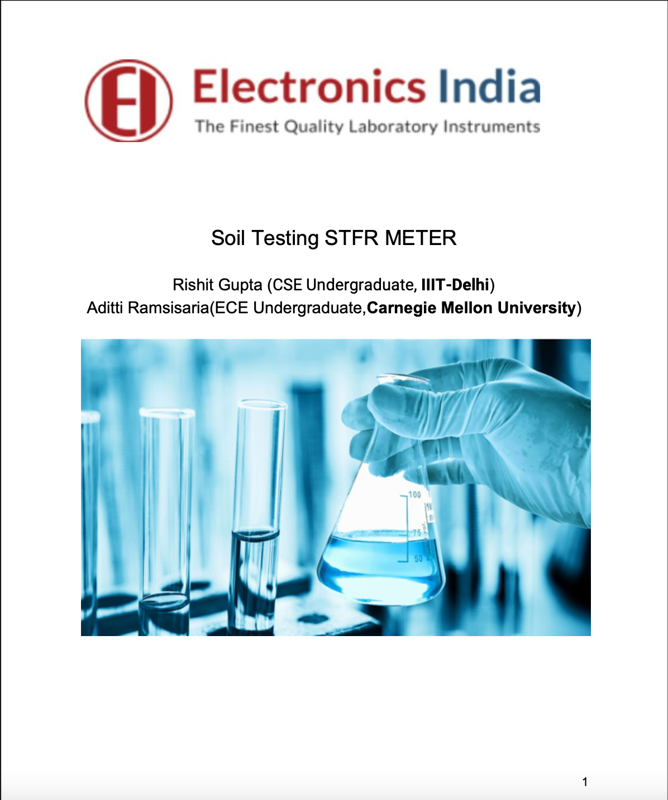
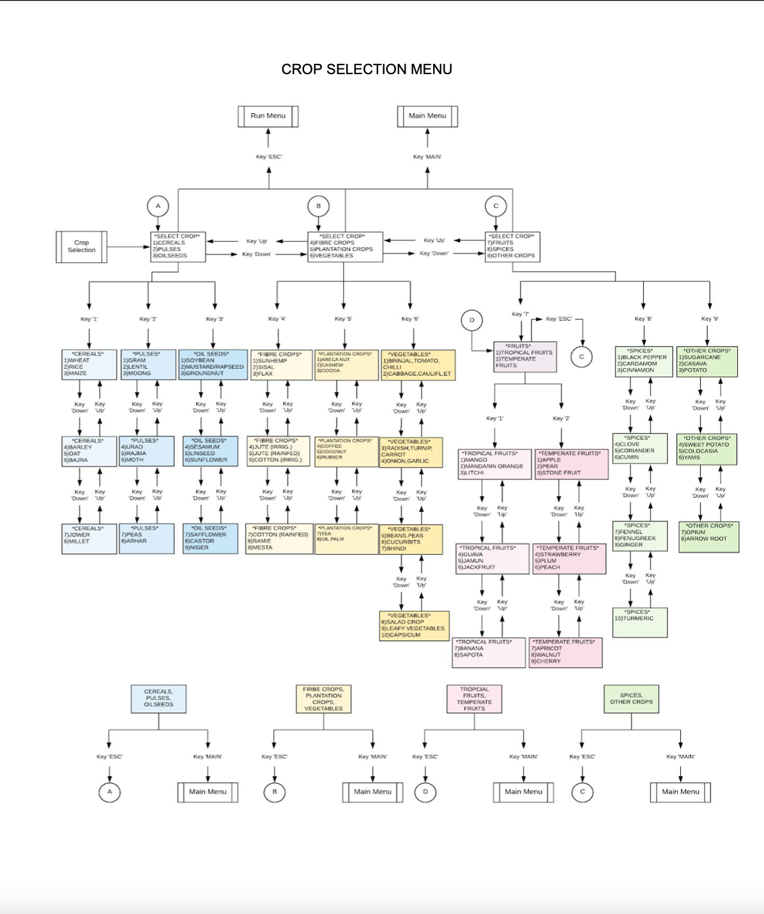
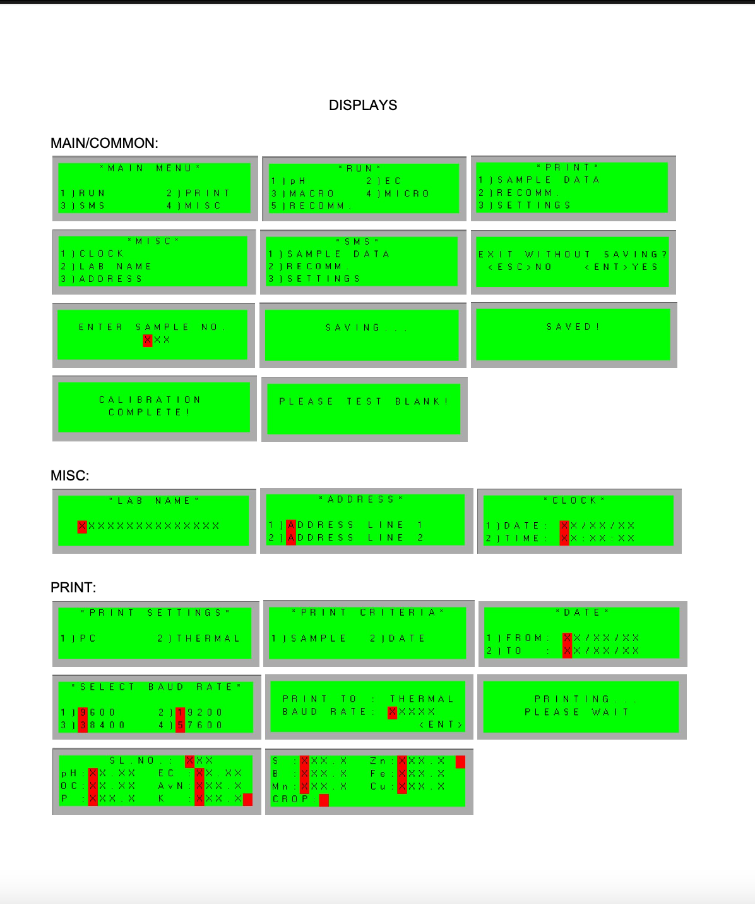
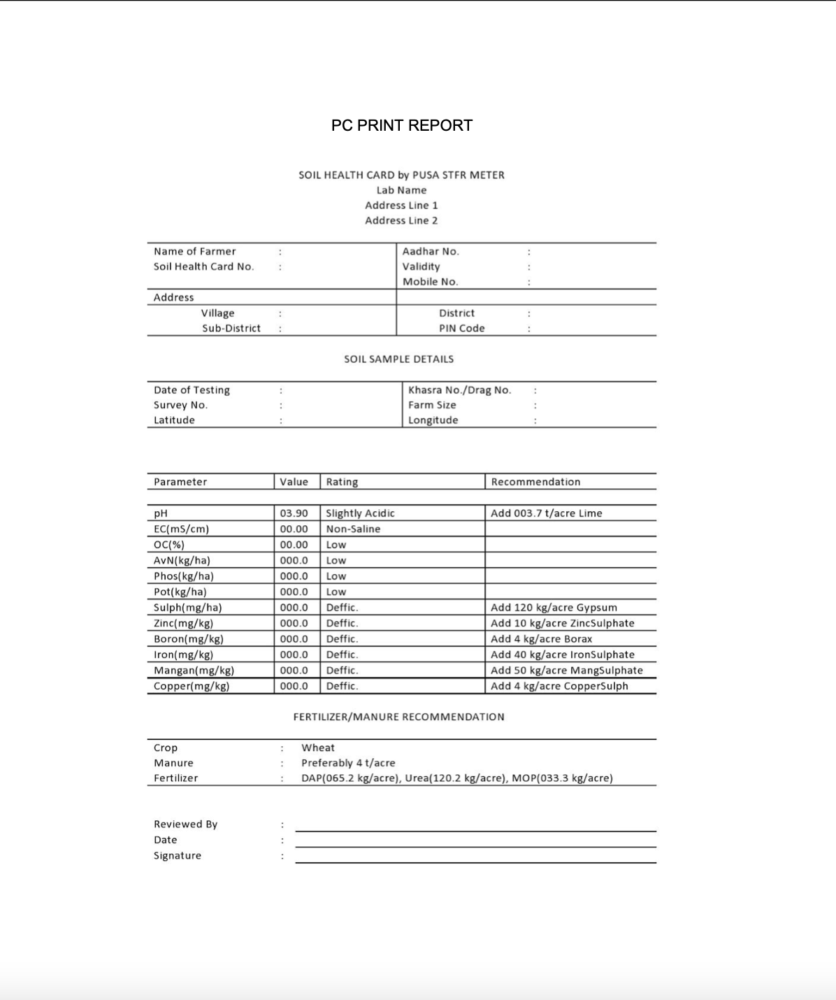
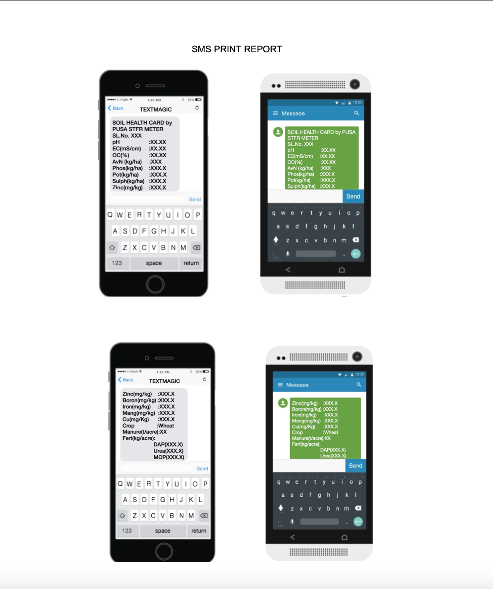

# Soil-Testing-STFR-METER
*  Designed and programmed an Arduino-based digital embedded system for testing soil fertility across 14 parameters and recommending fertiliser doses for over 100 crops.
* Researched and identified reagent compounds to determine relevant solvent concentrations for specific parameter testing via a photo colorimeter.
* Designed and built the user interface and logistical workflow for instrument usage.

## Check out the final work document in the repository.
## The code of the given project can't be shared on GitHub as it is the proprietary code of the company
